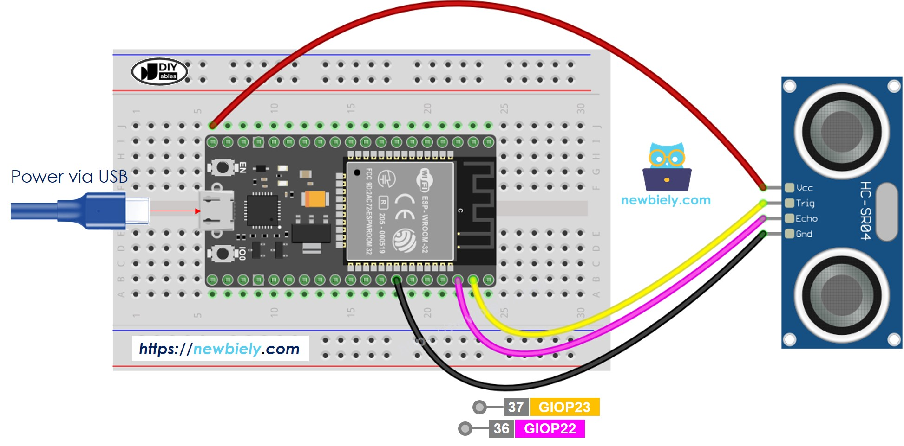

# Roteiro de desenvolvimento

## Configuração da ESP para leitura de dados utilizando o sensor HC-SR04

O sensor HC-SR04 usa um sonar ultrassonico para determinar a distância entre objetos, sendo o ponto principal da nossa aplicação, o que irá indicar se o objeto em questão foi ou não movimentado.

Para dar inicio a aplicação, copie a estrutura do diretório HC_SR04_BLE, o que pode ser feito com o comando:

```bash
    idf.py create-project $HC_SR04_BLE$
 ``` 

> [NOTE]
> O tutorial para utilizar no linux está no arquivo ESP-IDF_linux.md, presente nesse diretório.

Ou insira manualmente o conteúdo dos arquivos, não esqueça dos CMakesLists.txt em ambas as pastas do projeto.

Tendo todo código preparado, faça a montagem do circuito na protoboard, como na imagem a seguir:


 


Atente ao número dos GPIOS escolhidos e os colocados no código.

É necessário habilitar o *Bluetooth*, abra o menu de configuração:

```bash
    idf.py menuconfig
 ``` 
 Navegue até Component config -> Bluetooth e ative; lembre de salvar as configurações antes de sair.

Agora podemos *buildar* o projeto, rodando a seguinte sequencia de comandos:

```bash
    idf.py build

    idf.py -p /dev/ttyACM0 flash monitor
```

Se o circuito foi montado corretamente e os códigos estão certos, o build deverá funcionar corretamente.


## Configuração da Rasp ou do de um ambiente de recebimento

É possível testar a conexão localmente rodando o código em python no diretório rasp em um computador local, e averiguar o recebimento de mensagens, ou rodar na raspberry-pi.

Ao movimentar o objeto alvo do sensor, deverá ser emitido uma mensagem avisando, o que indica alguém tentando mexer em seus pertences.
